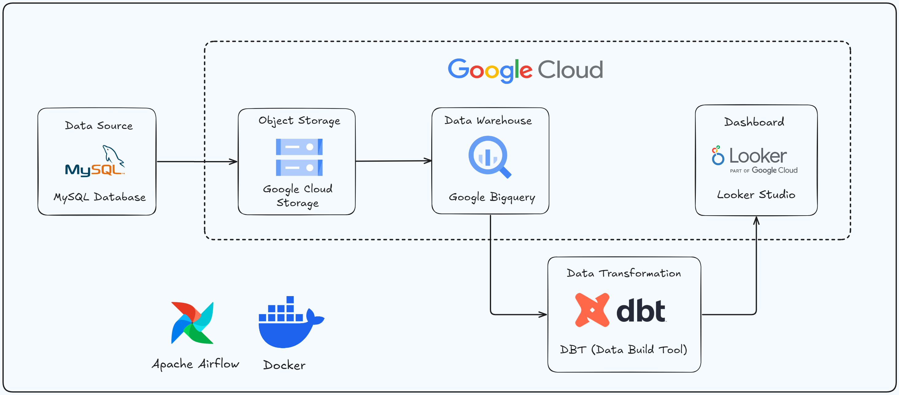
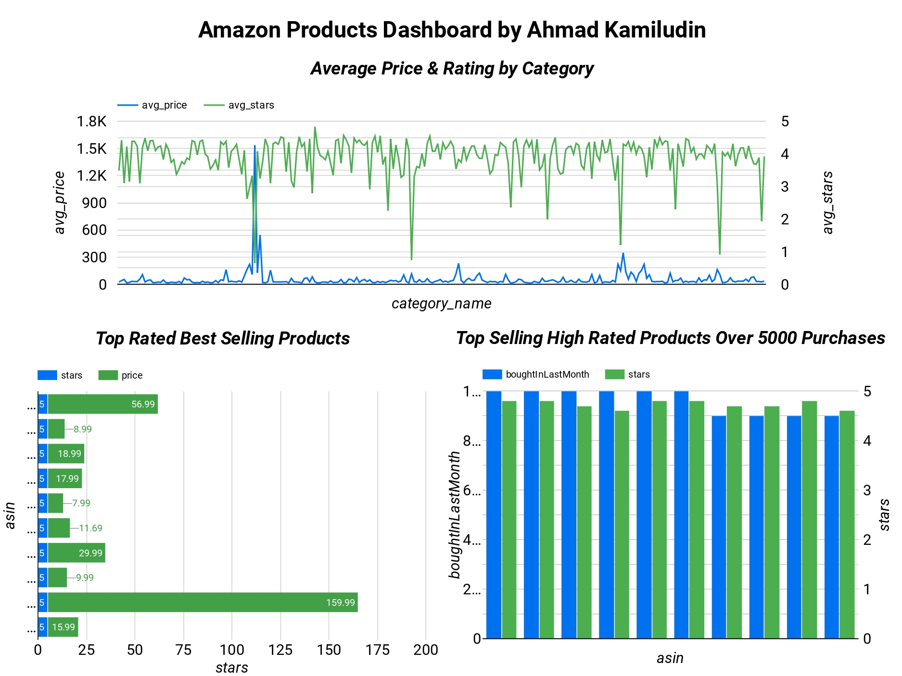

# Scalable Data Pipeline for Amazon Products with MySQL, Google Cloud, DBT, and Looker Studio

## Introduction

This project aims to build an automated and scalable ELT (Extract, Load, Transform) pipeline using cloud technologies. Product data will be extracted from MySQL, loaded into Google Cloud Storage (GCS), and transferred to Google BigQuery, where DBT Core will handle the data transformations. The transformed data will then be visualized in Looker Studio, providing insights into trends and sales. The process is automated using Apache Airflow to ensure smooth data flow without manual intervention. The project utilizes the Amazon Products 2023 dataset from Kaggle and is designed to enhance efficiency and scalability in managing large datasets, allowing for deeper analysis and quicker decision-making.

## Architecture 

## Simple Dashboard

## Technology Used
- MySQL Database
- Google Cloud Storage
- Google Bigquery
- DBT (Data Build Tool)
- Looker Studio
- Docker
- Apache Airflow
- Python
- SQL

## Dataset Used
Amazon Products Dataset 2023 (1.4M Products). Amazon is one of the biggest online retailers in the USA that sells over 12 million products. With this dataset, you can get an in-depth idea of what products sell best, which SEO titles generate the most sales, the best price range for a product in a given category, and much more.

More info about dataset:
https://www.kaggle.com/datasets/asaniczka/amazon-products-dataset-2023-1-4m-products/data

## Article About this Project 
Medium Article - https://medium.com/@ahmadkamiludin/building-a-scalable-data-pipeline-for-amazon-products-with-mysql-google-cloud-dbt-and-looker-ee7f0e265be5
